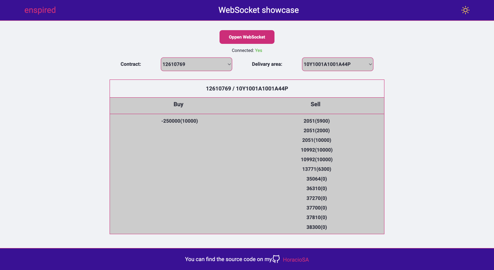
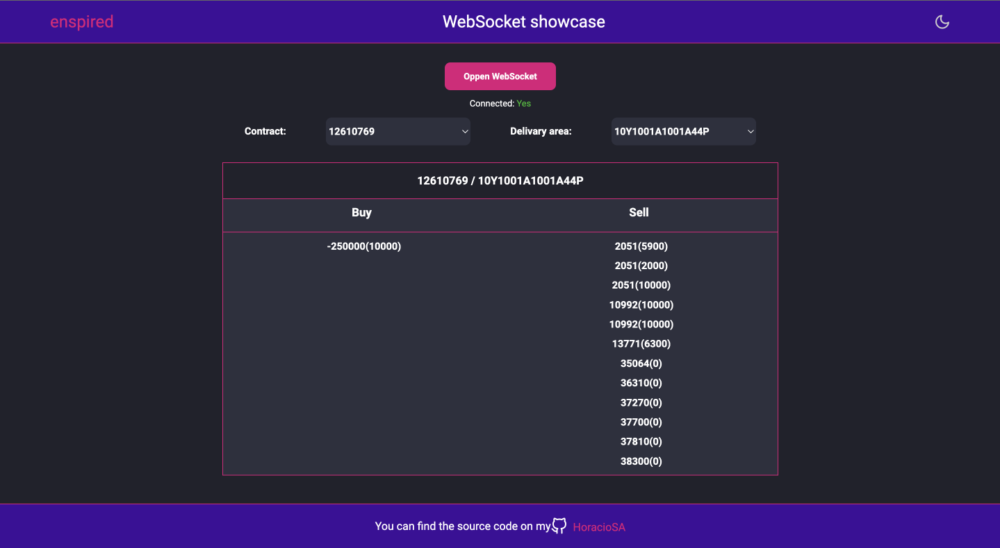

## Exchange data websocket task

<p align="center">
  <a href="#-About">About</a>&nbsp;&nbsp;&nbsp;|&nbsp;&nbsp;&nbsp;
  <a href="#-Layouts">Layout</a>&nbsp;&nbsp;&nbsp;|&nbsp;&nbsp;&nbsp;
  <a href="#-Usage">Usage</a>&nbsp;&nbsp;&nbsp;|&nbsp;&nbsp;&nbsp;
  <a href="#-Technologies">Technologies</a>&nbsp;&nbsp;&nbsp;|&nbsp;&nbsp;&nbsp;
  <a href="#memo-Licence">Licence</a>&nbsp;&nbsp;&nbsp;|&nbsp;&nbsp;&nbsp;
</p>

## :memo: About

The task was to write a React app that connects to a websocket, retrieves data from there and aggregates it in order to show it in an orderly manner.

## :card_index: Layouts

<br>
<p align="center">
    <h4>:high_brightness: Ligth mode</h4>
  
</p> 
<br>
<br>
<p  align="center">
<h4>:waning_crescent_moon: Dark mode</h4>
  
</p>
</br>

## 🧠 Use:

1. Rename the .env.exemple to .env.local and replce your ip adress and the port
2. Open a new bash shell
3. ```npm install``` or ```yarn install```
4. ```npm run dev``` or ```yarn dev```
5. You can visit [http://localhost:3000](http://localhost:3000) with your browser to see the result.

## 🚀 Technologies

|    Lib       | Version  |
| ------------ | -------- |
| nextjs       | 12.1.4   |
| react        | 17.0.0   |
| websocket    |    --    |

##  :bookmark: License

This project is [MIT](LICENSE) licensed.

---

Made ♥ by Horacio Sapato


